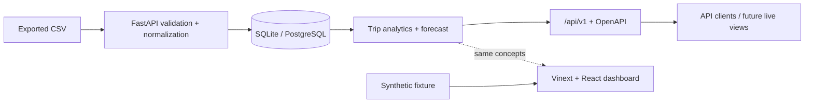

# RangeLab EV

**Privacy-first telemetry and range intelligence for a 2018 Chevrolet Bolt.**

RangeLab EV turns exported, read-only EV logs into validated trips, explainable
energy metrics, and an honest arrival-charge forecast. The repository pairs a
polished synthetic-data dashboard with a versioned FastAPI analytics service,
relational persistence, tests, containers, and the documentation needed to
defend every design choice in an interview.

[**Open the live synthetic dashboard →**](https://rangelab-ev.caelan.chatgpt.site)

> **Demo disclosure:** every value in the public web experience is synthetic.
> No real route, VIN, account, or raw vehicle log is committed to this project.

## What it demonstrates

- **Full-stack ownership:** React/TypeScript interface, FastAPI, Pydantic,
  SQLAlchemy, SQLite/PostgreSQL, and OpenAPI
- **Real-world ingestion:** bounded CSV uploads, header normalization, per-row
  validation with aggregate rejection warnings, unit-aware telemetry, and
  configurable trip segmentation
- **Explainable analytics:** energy use, regeneration, efficiency, summaries,
  and a forecast contract compared with a simple baseline
- **Engineering judgment:** synthetic-first demos, no vehicle write path,
  explicit model limits, and careful third-party PID attribution
- **Delivery discipline:** one-command Docker setup and GitHub Actions for web,
  API, and container checks

## Product surfaces

| Surface | What a reviewer can do | Data |
| --- | --- | --- |
| Web dashboard | Explore a realistic Bolt trip, charts, signals, forecast context, and methodology | Deterministic synthetic sample |
| REST API | Import CSV text/files, inspect trips and telemetry, request a forecast, and view diagnostics | Synthetic fixture or a private local export |
| Documentation | Audit architecture, privacy, vehicle safety, data/model limits, ADRs, and evidence | Versioned with the code |

The public dashboard is deliberately self-contained so it works without a
vehicle or hosted database. The API is demonstrated through its generated
OpenAPI interface and is the integration boundary for future user-uploaded
trip views.

## Architecture



See [Architecture](docs/ARCHITECTURE.md) and the
[architecture decisions](docs/adr/) for boundaries and tradeoffs.

## Quick start — complete stack

Requirements: Docker Desktop (or Docker Engine with Compose).

```bash
docker compose up --build
```

Open:

- Dashboard: `http://localhost:3000`
- API docs: `http://localhost:8000/docs`
- API health: `http://localhost:8000/health`

> **Local-only API:** Compose binds the web and API ports to `127.0.0.1` by
> default. The API has no authentication, authorization, or tenant isolation.
> CORS is not access control. Do not change `RANGELAB_BIND_HOST` to `0.0.0.0`
> or expose port 8000 to a LAN or the internet without an authenticated reverse
> proxy, TLS, and a real retention/deletion policy.

PostgreSQL data is kept in a named Docker volume. Press `Ctrl+C` to stop the
stack. `docker compose down` removes containers but preserves the volume;
`docker compose down --volumes` also permanently deletes its local database.

The defaults are intended for one trusted user on the same machine. Copy
`.env.example` to `.env` before importing private data, replace its database
password and identity-secret placeholders, and keep that file out of version
control. The checked-in Compose identity fallback is deliberately public and
only preserves local demo idempotency across restarts; it is not a real secret.

## Native development

### Web

Requirements: Node.js 22.18+ and pnpm 11.19.

```bash
corepack enable
pnpm install --frozen-lockfile
pnpm dev
```

Useful checks:

```bash
pnpm lint
pnpm test
```

Release-candidate verification recorded 4/4 frontend `node:test` cases passing,
along with lint, type-check, and production build checks. CI reruns the same
checks from a clean checkout.

### API

Requirements: Python 3.11+.

```bash
cd backend
python -m venv .venv
# Activate .venv using the command for your shell.
python -m pip install -e ".[dev]"
uvicorn rangelab.api:app --reload --port 8000
```

The native API defaults to a local SQLite database. Run its tests with:

```bash
pytest
```

Release-candidate verification recorded 42 passing backend tests with 89%
branch-aware coverage. CI enforces at least 85% and also exercises a real
PostgreSQL service through the public API before building both containers.

## API walkthrough

Import a synthetic CSV file:

```bash
curl -X POST http://localhost:8000/api/v1/imports/csv \
  -F "file=@data/synthetic_bolt_trips.csv;type=text/csv"
```

Then use the returned identifiers with:

```text
GET  /api/v1/imports/{id}
GET  /api/v1/trips
GET  /api/v1/trips/{id}
GET  /api/v1/trips/{id}/telemetry
GET  /api/v1/summary
POST /api/v1/forecast
GET  /api/v1/model/diagnostics
```

Exact request and response schemas live at `/openapi.json`. See
[API usage](docs/API.md) for more examples.

### Reproducible synthetic benchmark

```bash
cd backend
python -m rangelab.evaluation ../data/synthetic_bolt_trips.csv
```

The checked-in seed-2018 fixture contains 1,908 samples segmented into 16
synthetic trips (301.852 km). On that fixture, expanding-window evaluation
produces 0.3414 kWh model MAE versus 0.3480 kWh for the distance-only baseline,
a 1.9% improvement across eight evaluated trips. These numbers prove the
pipeline is reproducible; they are **not** real-Bolt accuracy evidence or a
finished résumé claim.

## Repository map

```text
app/                     Web routes, components, sample data, and styles
backend/src/rangelab/    API, domain logic, ingestion, privacy, and persistence
backend/tests/           Python unit and integration tests
docs/                    Architecture, operations, data/model cards, ADRs
.github/workflows/       Automated web, API, PostgreSQL, and container checks
Dockerfile               Web production image
Dockerfile.backend       API production image
docker-compose.yml       Web + API + PostgreSQL local stack
```

## Safety, privacy, and honest limits

- RangeLab EV imports files; it does **not** connect to or control a vehicle.
- Do not interact with logging devices or dashboards while driving.
- Do not commit raw real-world trips. Location and timestamp patterns can
  identify a person even when names are removed.
- Community Bolt PIDs can be uncertain, and their definition lists may use
  terms different from this repository's MIT license.
- Forecasts are estimates, not battery diagnostics, safety guarantees, or a
  replacement for the vehicle display.

Read [Vehicle safety](docs/VEHICLE_SAFETY.md),
[Privacy](docs/PRIVACY.md), [PID attribution](docs/PID_ATTRIBUTION.md), the
[Data card](docs/DATA_CARD.md), and the [Model card](docs/MODEL_CARD.md).

## Demo and project evidence

The public web demo is live at
[rangelab-ev.caelan.chatgpt.site](https://rangelab-ev.caelan.chatgpt.site) and
publishes through Sites using the checked-in hosting manifest. GitHub Pages is
static and cannot host the FastAPI/PostgreSQL services. The
[demo guide](docs/DEMO.md) explains the supported portfolio setup.

Measured résumé claims belong in the [evidence ledger](docs/RESUME.md). The
checked-in evaluation supports only the explicitly labeled synthetic numbers;
real-trip scale and accuracy remain placeholders until a sanitized, versioned
real-world evaluation exists.

## Project status and roadmap

Version 1 is scoped as a complete portfolio release, not a production vehicle
service. Real-trip evaluation, capacity trending, route/weather enrichment, and
experimental read-only adapter work are intentionally separated in the
[roadmap](docs/ROADMAP.md).

## Attribution and license

Project source code is available under the [MIT License](LICENSE). Third-party
Bolt PID definitions are **not** included or relicensed. Community references
and their distinct terms are recorded in
[PID attribution](docs/PID_ATTRIBUTION.md).

Chevrolet, Bolt, OnStar, Torque Pro, EngineLink, and OBD Fusion are trademarks
of their respective owners. This independent educational project is not
affiliated with or endorsed by General Motors or those products.
