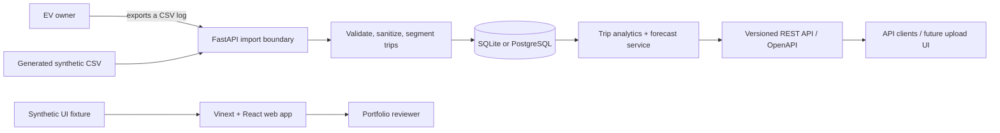

# Architecture

RangeLab EV is a modular monolith with a separately deployable web interface
and API. It is intentionally small enough for one student to own while showing
clear boundaries, durable storage, validation, testability, and deployment
discipline.

## System context

There is deliberately no arrow from RangeLab EV back to the vehicle. Version
1 accepts previously exported text and has no direct OBD-II, CAN, OnStar, or
vehicle-control integration.

## Runtime components

| Component | Responsibility | Technology |
| --- | --- | --- |
| Web | Explain representative analytics through a standalone synthetic sample | React, TypeScript, Vinext |
| API | Validate input, expose trips and forecasts, publish OpenAPI | FastAPI, Pydantic |
| Domain services | Normalize samples, segment trips, calculate aggregates, forecast | Python |
| Persistence | Store imports, trips, and telemetry behind a repository boundary | SQLAlchemy; SQLite locally, PostgreSQL in Compose |
| Demo data | Make the web and API reviewable without a car or private records | Separate synthetic, deterministic fixtures |
| Delivery | Provide one-command local startup and automate checks | Docker Compose, GitHub Actions |

## Request and data flow

1. A client sends a CSV file or CSV text to `/api/v1/imports/csv` or
   `/api/v1/imports/csv-text`.
2. The import boundary limits the payload, parses known columns, validates
   values, drops rows with unusable timestamps, ignores out-of-range sensor
   values, and returns aggregate counts/warnings. It does not return a detailed
   per-row error list.
3. The domain layer normalizes units and splits samples into trips using the
   configured time-gap rule.
4. Privacy options are applied before SQLAlchemy persists import metadata and
   derived trip/sample records. The original CSV body and privacy-zone
   configuration are not stored. Domain-separated, secret-keyed HMAC values
   support internal deduplication/idempotency but are excluded from public API
   models; public import and trip IDs are independent random UUIDv4 values.
5. Read endpoints return summaries or ordered telemetry; the forecast endpoint
   returns an estimate with its assumptions and diagnostics.
6. The v1 web interface independently renders a clearly labeled synthetic trip.
   API-backed user uploads are a later integration rather than a hidden claim.

The authoritative endpoint contract is always the generated OpenAPI document
at `/openapi.json`; examples are in [API usage](API.md).

## Trust boundaries and invariants

Untrusted CSV crosses the most important trust boundary. The parser must not
execute spreadsheet formulas, shell text, SQL, or Python contained in a cell.
Uploads are bounded, schema-checked, and handled as data.

The following invariants are non-negotiable:

- no write/control message is transmitted to a vehicle;
- raw personal trip files are never required in the public repository;
- the demo must be usable with synthetic data;
- timestamps within a trip are ordered before integration;
- energy and distance calculations state their units;
- forecasts expose limitations and do not masquerade as safety guarantees; and
- API-breaking changes require a new version prefix or migration notes.

## Storage choices

SQLite is the zero-configuration default for local API development and tests.
PostgreSQL is used by the full Docker Compose stack to exercise a production-
style database. Keeping SQLAlchemy between the domain and database lets both
paths share behavior.

The repository does not treat a local database as source material. Database
files, raw uploads, and generated model artifacts remain ignored. Schema
changes should be reviewed like API changes and accompanied by a migration once
persistent user data is supported beyond the portfolio demo.

The HMAC identity key is process-random for an unconfigured native API. A
persistent database therefore needs a stable `RANGELAB_IDENTITY_SECRET` of at
least 32 UTF-8 bytes with high entropy; rotation changes request identities and
idempotency matching. Compose supplies a clearly non-production local fallback
for restart consistency. Neither an internal HMAC nor an opaque UUID makes
normalized route telemetry anonymous.

## Failure behavior

- Malformed or unsupported input produces a structured client error.
- A partially invalid import reports aggregate dropped/ignored counts and
  warnings; it must not invent values to make a trip appear complete.
- Empty API result sets are valid collections; the standalone web demo does not
  currently render API-backed empty states.
- External network services are not required for the core demo.
- A forecast request outside Pydantic's supported bounds is rejected. Accepted
  forecasts include assumptions and an uncertainty band. The engineering
  fallback band has no claimed probability or calibrated coverage; neither the
  estimate nor its band is a vehicle-range guarantee.

## Deployment topology

`docker compose up --build` starts three containers: web, API, and PostgreSQL.
Published host ports bind to `127.0.0.1` by default because the API has no
authentication or tenant isolation. CORS is a browser policy, not access
control. For a public portfolio demo, only the synthetic web experience should
be published through Sites. Hosting the API/database would require an
authenticated gateway, TLS, production secrets, deletion/retention controls,
monitoring, and a restricted CORS allowlist.

## Dependency reproducibility

The web build uses the checked-in pnpm lockfile. Python dependencies currently
use bounded compatibility ranges in `pyproject.toml`, not a fully resolved
cross-platform lock, so a future install is not guaranteed to be byte-for-byte
identical. CI runs `pip check`, the full SQLite test suite, a PostgreSQL-backed
API smoke flow, and container builds against the resolver result. A long-lived
production release should additionally publish resolved constraints or an SBOM;
this portfolio release does not claim bit-for-bit Python reproducibility.

## Recorded decisions

- [ADR 0001: Modular monolith](adr/0001-modular-monolith.md)
- [ADR 0002: Import-first, read-only telemetry](adr/0002-import-first-read-only.md)
- [ADR 0003: Transparent forecasting before complex ML](adr/0003-transparent-forecasting.md)
- [ADR 0004: Synthetic public demo data](adr/0004-synthetic-public-demo.md)
